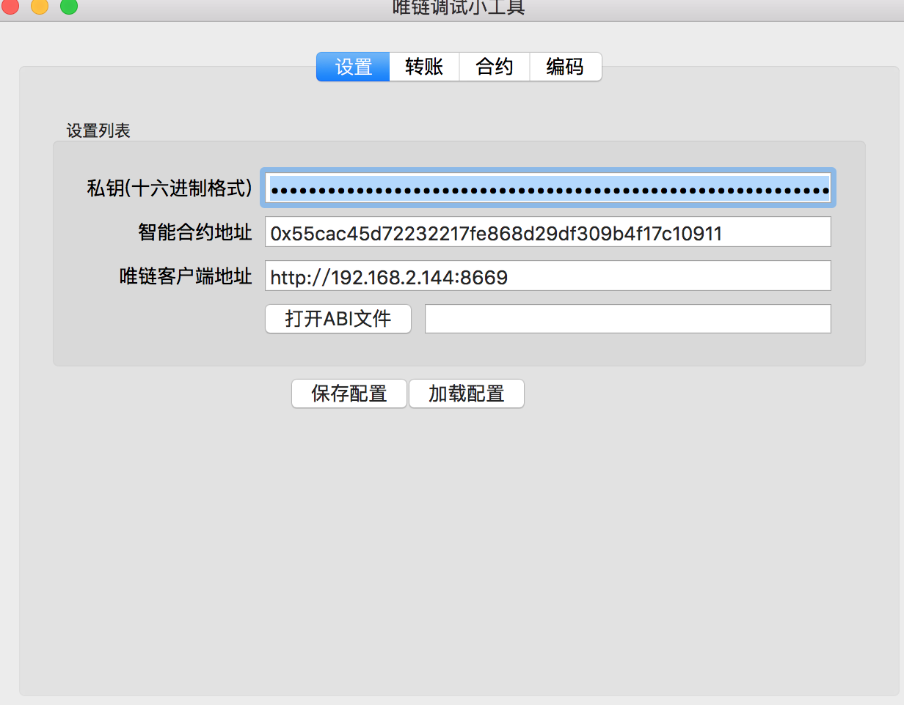
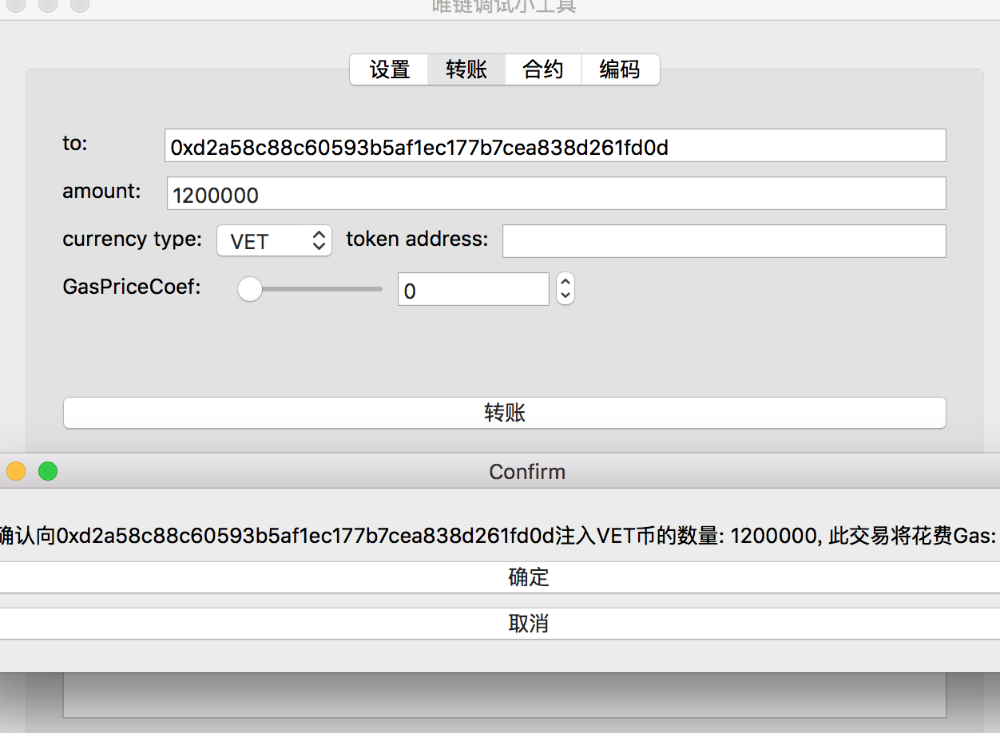
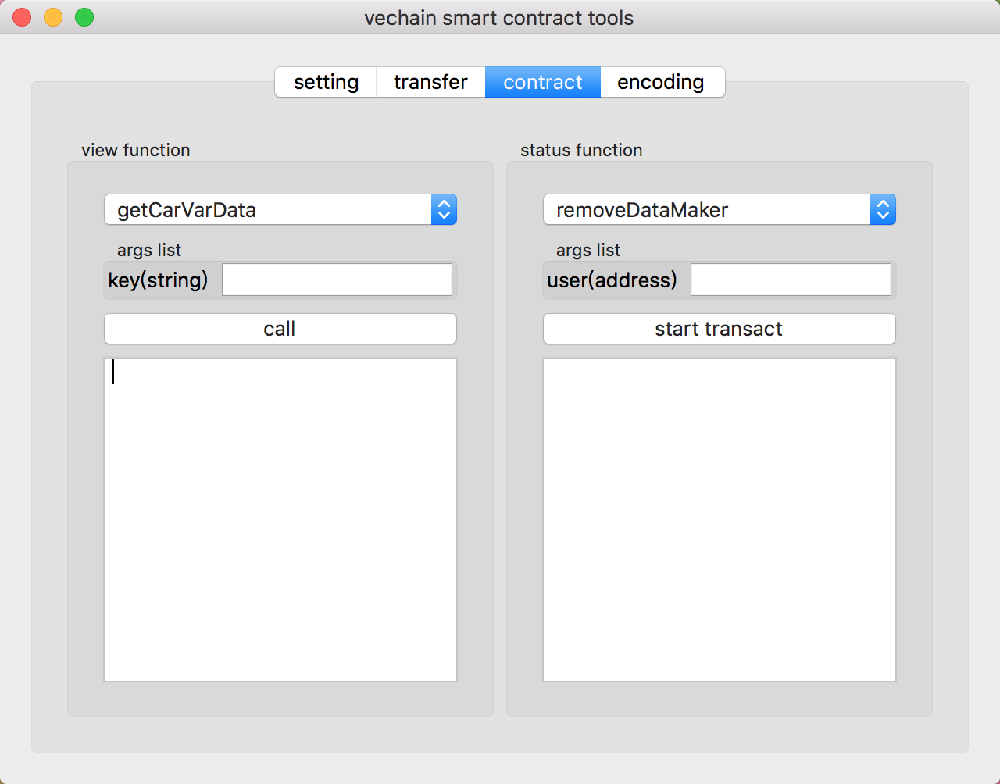
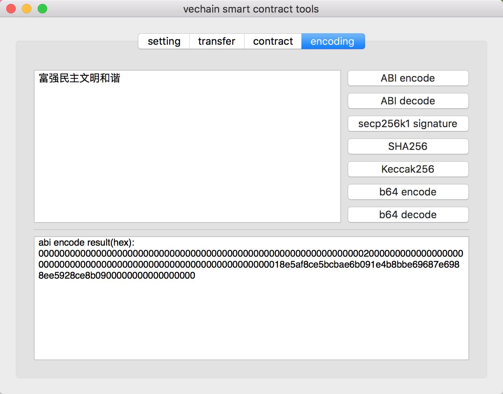
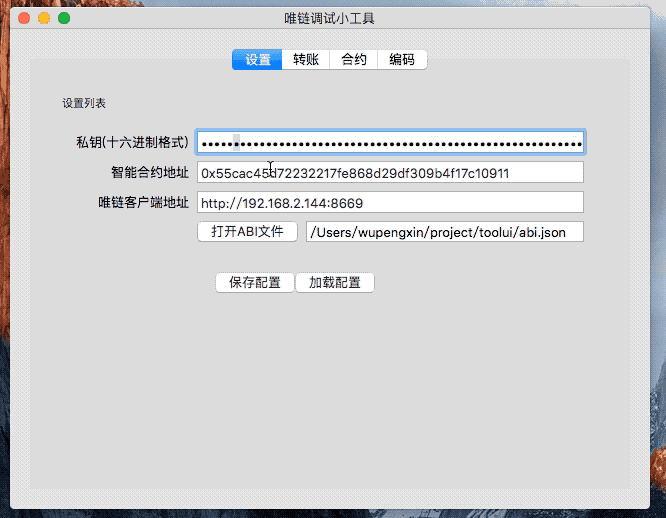

# vechaintool
一个对于开发者友好的唯链智能合约开发调试小工具

#### 源码编译

##### 要求
- Go >= 1.11

##### 克隆项目

```shell
git clone https://github.com/wupeaking/vechaintool && cd vechaintool
```

##### 下载依赖包

```shell
go mod download
# 国内用户 可以使用代理
GOPROXY=https://goproxy.io go mod download
``` 

##### 编译二进制文件

```shell
go build -o tools main.go
```

```shell
# 如果需要交叉编译
GOOS=windows GOARCH=amd64 CGO_ENABLED=1 CC=x86_64-w64-mingw32-gcc CXX=x86_64-w64-mingw32-g++ go build -v -o tools.exe main.go
```

#### 截图

1. 配置页面



2. 转账页面



3. 合约调用页面



4. 编码功能




#### 使用示例


